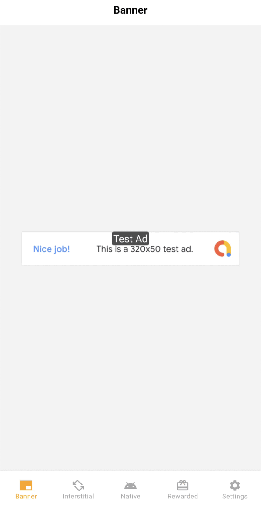

# Flutter Google Ads Integration Example with Customizable Native Ads

This project demonstrates a comprehensive implementation of Google AdMob in Flutter, with a special focus on **Customizable Native Ad Layouts**. It showcases how to create and manage different native ad formats that perfectly match your app's design, along with other ad formats for both Android and iOS platforms.

## Features

### 1. Native Ads Implementation
The project showcases three different native ad layouts for both Android and iOS:

#### List Tile Native Ad
- Basic layout with icon, headline, and body text
- Designed to blend in with list views
- Implemented using custom XML layouts for Android and XIB files for iOS

#### Background Native Ad
- Enhanced layout with a custom background
- Includes icon, headline, and body text
- Custom styling to make ads stand out

#### Media Native Ad
- Advanced layout featuring a media view for images/videos
- Includes headline, body text, and call-to-action button
- Larger format suitable for rich media content

### 2. Banner Ads
- Implementation of standard banner ads
- Easy integration with Flutter widgets
- Responsive layout support

### 3. Interstitial Ads
- Full-screen interstitial ad implementation
- Proper lifecycle management
- Loading and display handling

### 4. Rewarded Ads
- Complete rewarded video ad integration
- Reward handling and callback implementation
- User reward tracking

## Platform-Specific Implementation

### Android Implementation
- Custom native ad layouts using XML
- Native ad factories for each layout type:
  - `NativeAdFactory`
  - `NativeAdWithBackgroundFactory`
  - `NativeAdMediaFactory`
- Proper registration in MainActivity

### iOS Implementation
- Custom XIB files for each native ad layout
- Native ad factories implemented in Swift:
  - `ListTileNativeAdFactory`
  - `BackgroundNativeAdFactory`
  - `MediaNativeAdFactory`
- Factory registration in AppDelegate

## Key Components

### Native Ad View Models
- Separate view models for managing different ad states
- Proper ad loading and disposal
- Error handling and state management

### Custom Layouts
- Responsive designs for different screen sizes
- Platform-specific UI components
- Consistent branding across ad formats

## Getting Started

1. Replace the ad unit IDs in the project with your own from the Google AdMob console
2. For iOS:
   - Update Info.plist with your GADApplicationIdentifier
   - Configure SKAdNetworkIdentifier
3. For Android:
   - Update AndroidManifest.xml with your AdMob app ID
   - Configure native ad layouts in res/layout

## Note

This project serves as a reference implementation for integrating various Google AdMob formats in Flutter, with a special focus on native ads. The implementation demonstrates how to create custom ad layouts that match your app's design while maintaining platform-specific best practices.